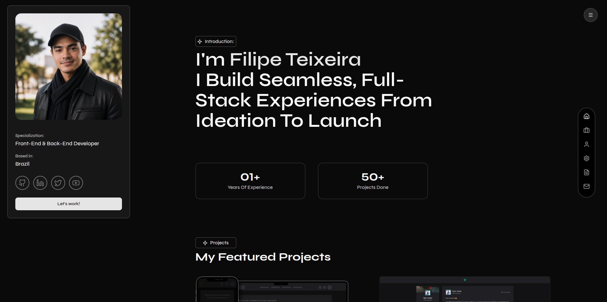

<p align="center" >
  
</p>
<h1 align="center"> Personal Portfolio </h1>

<p align="center">
  
  
  
  
  
  
  
</p>

<p align="center">
  <a href="#-technologies">Technologies</a>&nbsp;&nbsp;&nbsp;|&nbsp;&nbsp;&nbsp;
  <a href="#-project">Project</a>&nbsp;&nbsp;&nbsp;|&nbsp;&nbsp;&nbsp;
  <a href="#-layout">Layout</a>&nbsp;&nbsp;&nbsp;|&nbsp;&nbsp;&nbsp;
  <a href="#-license">License</a>
</p>

<p align="center">
  
</p>

<br>

<p align="center">
  
</p>

## 🚀 Technologies

This project was developed with the following technologies:

- TypeScript
- React
- Vite
- Tailwind CSS
- Lucide Icons
- Shadcn
- Git e Github

## 💻 Project

A living document of my work, growth, and the occasional late-night side project

## 💻 How to run

```bash
# Clone the repository
git clone https://github.com/filipebteixeira98/personal-portfolio.git

# Access the project folder
cd personal-portfolio

# Install the dependencies
npm install

# Run the project
npm run dev
# The project will be available at http://localhost:5173
```

## 📝 License

This project is under the MIT license.

<p align="center">
  Made with ♥ by me
</p>
